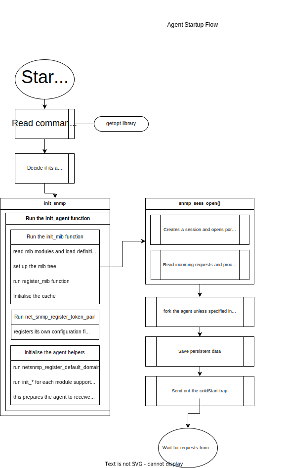

# SNMP AGENT ARCHITECTURE
The architecture of an SNMP (Simple Network Management Protocol) agent is a modular design that consists of the following components:

1. **MIB (Management Information Base) module:** This module contains definitions of all the SNMP objects that can be managed by the agent. The MIB module provides a hierarchical structure for organizing the SNMP objects.

2. **Agent core:** The agent core is the main component of the SNMP agent that provides the basic functionality for receiving, processing, and responding to SNMP requests. The agent core also provides access to the MIB module and provides a mechanism for registering MIB objects with the agent.

3. **Handler functions:** The handler functions are responsible for retrieving the data for the MIB objects and returning it to the agent core. The handler functions are registered with the MIB objects in the MIB module.

4. **Transport layer:** The transport layer is responsible for transmitting SNMP requests and responses between the SNMP manager and the SNMP agent. The transport layer provides a reliable and secure communication mechanism for SNMP traffic.

5. **Session layer:** The session layer provides a high-level interface for communicating with the SNMP manager. The session layer provides the necessary context information for processing SNMP requests and sending responses.

# SNMP AGENT STARTUP ROUTINE

## Reading Command line arguments
A net-SNMP agent reads command line options using the getopt library, which provides a convenient way for parsing the options passed to a program on the command line.

The net-SNMP agent supports various options that allow the user to control various aspects of its behavior, such as setting the location of the configuration file, specifying which MIB modules to load, and more.

To read command line options, the net-SNMP agent parses the arguments passed to it using getopt, and then performs the appropriate actions based on the options specified.
