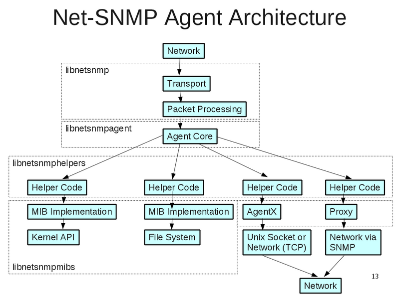

# SNMP AGENT ARCHITECTURE
The architecture of an SNMP (Simple Network Management Protocol) agent is a modular design that consists of the following components:

1. **MIB (Management Information Base) module:** This module contains definitions of all the SNMP objects that can be managed by the agent. The MIB module provides a hierarchical structure for organizing the SNMP objects.

2. **Agent core:** The agent core is the main component of the SNMP agent that provides the basic functionality for receiving, processing, and responding to SNMP requests. The agent core also provides access to the MIB module and provides a mechanism for registering MIB objects with the agent.

3. **Handler functions:** The handler functions are responsible for retrieving the data for the MIB objects and returning it to the agent core. The handler functions are registered with the MIB objects in the MIB module.

4. **Transport layer:** The transport layer is responsible for transmitting SNMP requests and responses between the SNMP manager and the SNMP agent. The transport layer provides a reliable and secure communication mechanism for SNMP traffic.

5. **Session layer:** The session layer provides a high-level interface for communicating with the SNMP manager. The session layer provides the necessary context information for processing SNMP requests and sending responses.

# SNMP AGENT STARTUP ROUTINE

## Reading Command line arguments
A net-SNMP agent reads command line options using the getopt library, which provides a convenient way for parsing the options passed to a program on the command line.

The net-SNMP agent supports various options that allow the user to control various aspects of its behavior, such as setting the location of the configuration file, specifying which MIB modules to load, and more.

To read command line options, the net-SNMP agent parses the arguments passed to it using getopt, and then performs the appropriate actions based on the options specified.

## Deciding if the agent is a subagent or master agent
A net-SNMP agent decides if it is a master agent or a subagent based on the options passed to it on the command line.

To decide if it is a master agent or a subagent, the net-SNMP agent checks for the presence of a specific option, such as -M (for master agent) or -S (for subagent) on the command line.

## The init_snmp function
The init_snmp function performs several important tasks, including:

1. **Initializing the SNMP library:** The init_snmp function calls the init_snmp function from the libnetsnmp library, which initializes the SNMP library and prepares it for use by the agent.

2. **Parsing command-line options:** The init_snmp function parses the command-line options passed to the agent and sets the appropriate configuration values.

3. **Registering MIB modules:** The init_snmp function registers the MIB modules that the agent supports, allowing the SNMP library to access the MIB information and implement SNMP operations.

4. **Initializing the agent:** The init_snmp function calls the init_agent function, which initializes the agent helpers and prepares the agent to process SNMP requests and manage MIB information.

5. **Starting the agent:** The init_snmp function starts the SNMP agent, which begins listening for and processing SNMP requests.

## The init_agent function
The init_agent function in net-SNMP agents is used to initialize the SNMP agent and set up its basic configurations.

1. **Parsing command line options:** The init_agent function uses the getopt library to parse the command line options passed to the agent and sets the corresponding configuration variables based on these options.

2. **Initializing MIB modules:** The init_agent function loads the necessary MIB modules by calling the init_mib function, which reads the MIB definitions and sets up the data structures used to manage the MIB information.

3. **Setting up the agent's trap receiver:** The function sets up the trap receiver by calling the init_traps function, which sets up the socket and handler for incoming trap messages.

4. **Initializing the AgentX subagent protocol:** If the agent is running as a subagent, the init_agent function initializes the AgentX subagent protocol by calling the init_master function, which sets up the communication channel between the master agent and the subagent.

5. **Registering OID handlers:** Finally, the function registers the OID handlers, which are responsible for handling incoming SNMP requests for specific OIDs. The OID handlers are registered using the register_mib function from the SNMP library.

### The init_mib function
The init_mib function does the following:

1. **Reading the MIB modules:** The function reads the MIB modules specified on the command line or in the configuration file and loads the definitions of the MIB objects into memory.

2. **Initializing the MIB tree:** The init_mib function sets up the MIB tree, which is a hierarchical structure used to store the MIB information. Each node in the MIB tree represents an object in the MIB and is identified by a unique Object Identifier (OID).

3. **Registering MIB modules:** The function registers the MIB modules by calling the register_mib function, which adds the MIB definitions to the MIB tree. The function maps each MIB object to a specific OID in the MIB tree, and also sets up the handlers that are responsible for processing incoming SNMP requests for specific MIB objects.

4. **Initializing the cache:** The init_mib function also initializes the cache, which is a data structure used to store the values of frequently-accessed MIB objects. This helps to improve the performance of the SNMP agent by reducing the time required to retrieve MIB values.

